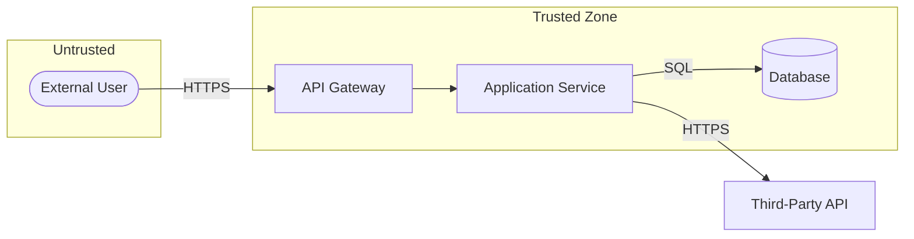

# Threat Model — [System Name]

Author: [name] · Date: [YYYY-MM-DD] · Version: [n] · Methodology: STRIDE

## 1. System Overview

One or two paragraphs: what the system does, its primary users, and its high-level shape
(e.g., a web app with a public API, an application tier, and a relational database). Name the
components that appear in the rest of the document.

## 2. Assets / Crown Jewels

The data and capabilities worth protecting. Be specific.

| Asset | Description | Sensitivity |
|-------|-------------|-------------|
| A1 | User PII (email, address) | High |
| A2 | Password hashes / credentials | Critical |
| A3 | Ability to issue refunds | High |
| A4 | Application availability | Medium |

## 3. Trust Boundaries

Describe each boundary where data crosses between differently-trusted zones, then a diagram.

- **TB1 — Internet ↔ Application:** untrusted clients reach the public API.
- **TB2 — Application ↔ Database:** the app tier reaches the private data store.
- **TB3 — Tenant ↔ Tenant:** logical isolation between customers' data.

(Mark trust boundaries as the edges crossing between the `Untrusted` and `Trusted` subgraphs.)

## 4. External Entities

| ID | Entity | Trust level | Interacts via |
|----|--------|-------------|---------------|
| E1 | End user | Untrusted | Public API |
| E2 | Admin | Semi-trusted | Admin console |
| E3 | Payment provider | External-trusted | Outbound HTTPS + webhook |

## 5. Data Flow Inventory

| DF | From → To | Payload | Crosses boundary | Entry point |
|----|-----------|---------|------------------|-------------|
| DF1 | User → API | Login credentials | TB1 | `POST /login` |
| DF2 | App → DB | User records | TB2 | — |
| DF3 | Provider → App | Payment webhook | TB1 | `POST /webhooks/payment` |

## 6. Threat Table

One row per applicable STRIDE category per element. Likelihood/Impact: Low/Medium/High.
Status: Mitigated / Partial / Accepted / Open.

| ID | Element | STRIDE | Threat | Likelihood | Impact | Mitigation | Status |
|----|---------|--------|--------|-----------|--------|------------|--------|
| T1 | DF1 | Spoofing | Credential stuffing logs in as a user | High | High | Rate limiting + MFA + breached-password check | Mitigated |
| T2 | DF1 | Tampering | MITM alters credentials in transit | Low | High | TLS 1.2+ enforced, HSTS | Mitigated |
| T3 | DF3 | Spoofing | Forged webhook with no authenticity | Medium | High | Verify provider HMAC signature | Mitigated |
| T4 | DF2 | Elevation | IDOR returns another tenant's records | Medium | Critical | Per-object tenant check on every query | Partial |
| T5 | `GET /export` | Denial of service | Unbounded export exhausts memory | Medium | Medium | Pagination + max page size + quota | Open |

## 7. Mitigations

For each mitigation referenced above, one line on the concrete control and where it lives.

- **M1 (T1):** Per-IP and per-account rate limit at the API gateway; TOTP MFA in auth service.
- **M3 (T3):** Reject webhooks whose `X-Signature` HMAC does not match the shared secret.
- **M4 (T4):** Repository layer filters by `tenant_id` from the session, not the request.

## 8. Residual Risks

Threats not fully closed, and why that is acceptable (or the plan to close them).

- **T4 (Partial):** Tenant check enforced in the repository but not yet in two legacy reports.
  Tracked for the next release.
- **T5 (Open):** Export endpoint unbounded; accepted for the current internal-only beta,
  must be fixed before public launch.

## 9. Assumptions / Out-of-Scope

**Assumptions:**
- TLS terminates at the load balancer; internal traffic is on a private network.
- Database is not reachable from the internet.
- Admin operators are trusted.

**Out-of-scope:**
- Physical security of the hosting provider.
- Insider threat from privileged operators.
- Supply-chain compromise of third-party dependencies (tracked separately).
